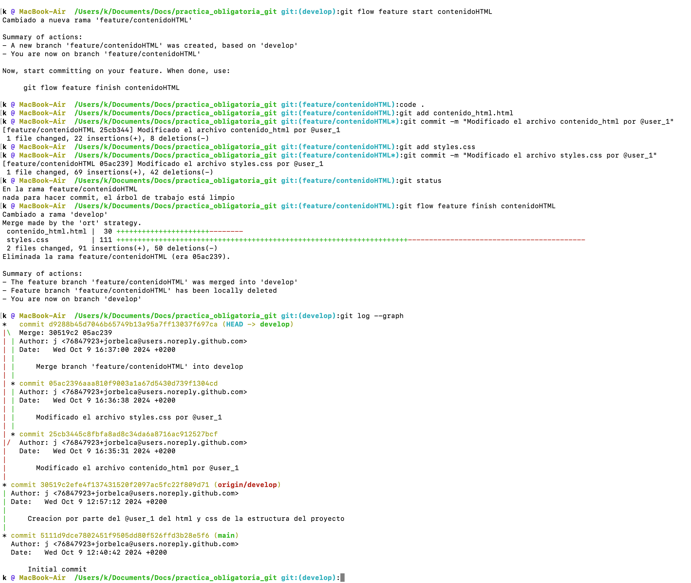

# Introducción a Git y la metodología Git Flow

## ¿Qué es Git?

**Git** es un sistema de control de versiones distribuido que permite a los desarrolladores gestionar y controlar los cambios en el código fuente a lo largo del tiempo. Con Git, podemos trabajar de manera colaborativa en un proyecto sin preocuparnos de sobrescribir los cambios de otras personas, ya que cada desarrollador trabaja en su propia copia del repositorio.

Las características principales de Git incluyen:

- **Historial de versiones**: permite guardar el estado del proyecto en varios momentos, facilitando volver a versiones anteriores.
- **Trabajo en ramas**: permite trabajar en diferentes funcionalidades o partes de un proyecto de manera independiente, fusionando los cambios cuando estén listos.
- **Distribuido**: cada usuario tiene una copia completa del repositorio, lo que permite trabajar de manera descentralizada.

## Git Flow

**Git Flow** es una metodología o flujo de trabajo para gestionar las ramas en Git, especialmente útil en proyectos con equipos de desarrollo grandes o con múltiples versiones en desarrollo simultáneamente. Está diseñado para hacer que el ciclo de desarrollo sea más organizado y eficiente.

### Las ramas principales en Git Flow:

- **master**: contiene el código que siempre está listo para producción.
- **develop**: es la rama donde se desarrolla el código y se prepara para su integración final.

A partir de estas ramas principales, se crean otras ramas paralelas según el flujo de trabajo:

- **Feature branches**: se crean desde `develop` para añadir nuevas funcionalidades.
- **Release branches**: se crean para preparar una nueva versión del proyecto, desde `develop` hacia `master`. Incluyen la creación de una etiqueta (tag).
- **Hotfix branches**: se crean desde `master` para corregir errores en producción de manera rápida y luego se fusionan con `master` y `develop`. Incluyen la creación de una etiqueta (tag).

## ¿Por qué utilizamos Git Flow?

Git Flow facilita el mantenimiento de un proyecto con diferentes versiones en desarrollo y permite gestionar fácilmente cambios críticos, como correcciones de errores urgentes, sin interrumpir el flujo de desarrollo normal.

Los beneficios de Git Flow incluyen:

- **Organización**: ayuda a mantener el código bien estructurado con un flujo de desarrollo claro.
- **Colaboración**: permite a los equipos trabajar en múltiples funcionalidades al mismo tiempo sin conflictos.
- **Control de versiones**: asegura que las versiones estén bien definidas y listas para producción.

Esta metodología es especialmente útil en equipos de desarrollo de software que necesitan gestionar múltiples entornos, como desarrollo, pruebas y producción.

# Proyecto de Git Flow, proceso

⚠️ **Avertencia!** Alguna vez aparece el commando _git config --global gpg.program gpg_, porque la firma de los commits me estaba dando algun problema

Empezamos, creando un proyecto en Github

---

Lo clonamos en local con **git clone**, e inicializamos git flow con **git flow init**, el cual nos hará una serie de preguntas para configurar las ramas segun queramos.

---

Empezamos con el codigo en si, abrimos Visual Studio Code y generamos la estructura del proyecto con los cuatro archivos html (index, atributos_html, contenido_html y estilos_CSS) y un archivo CSS (styles).
Despues, con **git add .** añadimos los archivos generados a la zona de trabajo y realizamos el commit (**git commit -m**) junto con el mensaje que describa lo que hemos hecho, describiendo el usuario que lo ha realizado (user_1)
Finalmente, con **git push origin develop** sincronizamos el trabajo con la rama en remoto.
(En este caso, he realizado los cambios directamente en develop porque no habia nada y consideraba un sin sentido crear una rama feature)

---

Comprobamos en Github que todo este correcto.

---

Haciendo uso de la libreria git flow, creamos una feature con el comando **git flow feature start**. Automaticamente se crea una nueva rama y nos cambia a ella.

Abrimos Visual Studio y modificamos el codigo debido, en este caso la seccion de la web que trata de modificar el contenido HTML. Seguidamente (y siguiendo el consejo que dio el profesor en clase) hacemos dos commits uno referente a la modificacion del HTML y otro para el CSS, asi se podra ver mejor la separacion en ramas de trabajo que si lo hiciesemos en un solo commit.

Seguidamente, comprobamos con **git status** que no haya nada en el area de trabajo y cerramos la feature (y la rama) con **git flow feature finish**. Finalmente, comprobamos que el arbol de trabajo sea correcto con **git log --graph**

⚠️ **Error!** En este commit me he equivocado y he puesto @user_1, cuando deberia ser @user_2.

---

Igual que antes, creamos una nueva feature.
Abrimos Visual Studio y modificamos el codigo debido, en este caso atributosHTML. Hacemos dos commits añadiendo el nombre de usuario, para segmentar el trabajo .

Y cerramos la feature (y la rama) con **git flow feature finish**.

---

Igual que en los anteriores, creamos una nueva feature.
Abrimos Visual Studio y modificamos el codigo debido, en este caso estilosCSS. Hacemos dos commits añadiendo el nombre de usuario, para segmentar el trabajo .

Y cerramos la feature (y la rama) con **git flow feature finish**.

---

En este paso, vamos a crear la release de todo el trabajo realizado. Para ello, la creamos con el comando **git flow release start +version**.
Automaticamente se crea una nueva rama y nos cambia a ella.
Abrimos Visual Studio y modificamos el codigo con los ultimos cambios antes de trasladarlo a produccion.
En este caso, se modifica el titulo de index.html y se crea un pequeño readme.md temporal.
Hacemos dos commits añadiendo las modificaciones anteriores junto nombre de usuario y cerramos la release (y la rama) con **git flow release finish**.
